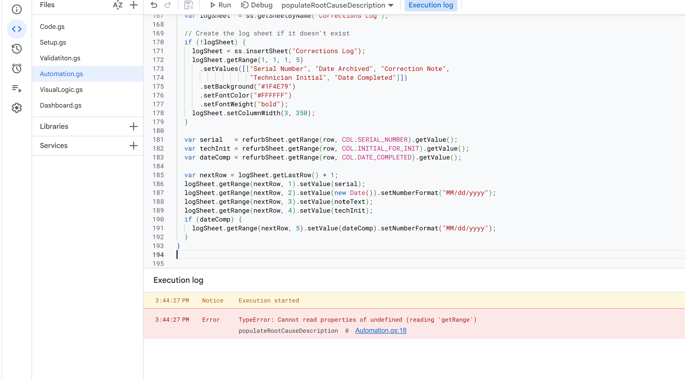

# Global Superstore Sales Dashboard — LinkedIn Demo Video
## Production Guide & Shot-by-Shot Script
**Target length:** 75–90 seconds | **Format:** OBS screen recording + voiceover

---

## BEFORE YOU RECORD

### Setup checklist
- [ ] Open the Global Superstore Sales Dashboard in Power BI Desktop
- [ ] Set the Year slicer to the full range (2011–2014) so all charts show full data
- [ ] Close the Format pane / Fields pane so only the report canvas is visible (View → cleaner layout)
- [ ] In OBS: create a **Display Capture** or **Window Capture** source scoped to Power BI Desktop only
- [ ] Set OBS output to **1920×1080**, 30fps, and do a 10-second test recording to check audio levels
- [ ] Close Outlook/Slack/Teams — no notification pop-ups mid-recording
- [ ] Use a mic if you have one; laptop mic is fine but sit close and quiet the room
- [ ] Do one full practice run before the real take

### Voice tone
Confident and explanatory — like you're walking a hiring manager through your own work, not reading a script. Slightly slower than natural conversation pace.

---

## SHOT-BY-SHOT SCRIPT

---

### SCENE 1 — HOOK (0:00 – 0:08)
**Screen:** Dashboard fully loaded, static, before any mouse movement.

**Narration:**
> "This is a sales dashboard I built in Power BI on a global retail dataset — about 31,000 orders across four years. But the real story here isn't the charts. It's a couple of DAX bugs that were quietly returning wrong numbers, and how I caught them."

---

### SCENE 2 — KPI PANEL WALKTHROUGH (0:08 – 0:25)
**Screen action:** Slowly move the mouse down the left KPI panel — Year slicer, then Sales Per Mth, Sales YOY, GPM, Avg Discount — pausing about a second on each card.

**Narration:**
> "Four KPIs, each answering a different business question. Sales Per Month gives a baseline monthly run-rate. Year-over-Year growth flags whether we're trending up or down — it's color-coded red or green dynamically, based on the live measure, not hardcoded. Gross Profit Margin checks whether growth is actually profitable. And Average Discount is paired with it deliberately — because revenue can look healthy while heavy discounting quietly eats the margin underneath it."

**On-screen text overlay (add in editing):**
- *"735K | -5.95% | 12.42% | 13.65%"* under each respective card

---

### SCENE 3 — THE DAX BUG STORY (0:25 – 0:45)
**Screen action:** Click on the Year slicer and drag it to filter down to a single year (e.g., 2013 only), then release — let the Sales YOY card visibly update.

**Narration:**
> "When I first built this, the Year-over-Year card was returning blank. It turned out to be a calculated column instead of a measure — calculated columns freeze at the row level and can't react to filter changes the way this needed to. I found a second bug too: a 'Sales Per Month' figure that returned the exact same number no matter which product category you filtered by, because it was counting distinct months against the wrong table.
>
> Instead of guessing, I connected directly to Power BI's live Analysis Services engine and ran DAX queries against the actual model to prove each bug and verify the fix before touching anything — the same approach a BI engineer would use to debug a production semantic model."

**On-screen text overlay:**
- *"Diagnosed live via DAX queries against the Tabular Model — not guesswork"*

---

### SCENE 4 — CHART BREAKDOWN (0:45 – 1:00)
**Screen action:** Scroll/pan across the four combo charts — Mth/Qtr/Year, Category/Subcategory, Segment, Market — pausing on each for ~2–3 seconds, hovering to show a tooltip on one bar in each.

**Narration:**
> "Beyond the KPIs, four charts answer the 'where' — which month, which product category, which customer segment, and which market is actually driving or dragging performance. Each one combines a sales column with three overlaid trend lines: growth, margin, and discount — so you're never looking at revenue in isolation from profitability."

**On-screen text overlay:**
- *"Sales (bars) + YoY / GPM / Discount (lines) — every chart, same lens"*

---

### SCENE 5 — THE MAP (1:00 – 1:12)
**Screen action:** Pan/zoom slightly on the Country choropleth map, hover over 2–3 countries to show tooltips.

**Narration:**
> "And this map shows geographic concentration by country — where the business is over-reliant on one region and where there's white space. Power BI's native map visual was actually blocked at the organization level, so I swapped in a third-party mapping visual and fixed a default polar-projection distortion to get a clean, readable Mercator view."

**On-screen text overlay:**
- *"Worked around a platform restriction — swapped visuals, fixed the projection"*

---

### SCENE 6 — IMPACT CLOSE (1:12 – 1:22)
**Screen:** Return to full dashboard view, let it sit fully loaded.

**Narration:**
> "The end result is a dashboard where every number is traceable back to a verified formula, every visual is dynamic — not hardcoded — and the KPIs are built around the questions a sales leader actually asks: are we growing, are we profitable, and where should we focus."

**On-screen text overlay (large, centered):**
```
2 hidden DAX bugs found & fixed
4 KPIs tied to real business questions
100% dynamic — zero hardcoded visuals
```

---

### SCENE 7 — CLOSING CARD (1:22 – 1:30)
**Screen:** Fade to a simple card (add in editing):
```
Global Superstore Sales Dashboard
Built by [Your Name]
Power BI · DAX · Data Modeling

Open to Data Analyst / BI Developer roles
judeojobo@gmail.com
```

**Narration:**
> "If you're working on BI, analytics, or data modeling problems — I'd love to connect."

---

## EDITING CHECKLIST (post-recording)

Use **Clipchamp** (free, built into Windows 11 — Win+G) or **DaVinci Resolve**:

1. **Trim** hesitations and dead air between scenes
2. **Add text overlays** listed above — white bold text, bottom third of screen
3. **Add subtle background music** — "corporate background music no copyright" on YouTube Audio Library, ~15% volume
4. **Zoom/crop** into the KPI panel and map during their respective scenes so small text/numbers are readable on mobile
5. **Captions**: turn on auto-captions — most LinkedIn video is watched muted
6. **Export** at 1080p MP4

---

## LINKEDIN POST COPY (paste this with the video)

```
I built a sales dashboard in Power BI — then found two hidden bugs in my own DAX before trusting a single number.

Global Superstore Sales Dashboard, built on ~31K orders across 4 years:

→ 4 KPIs tied to real business questions: run-rate, YoY growth, margin, discount pressure
→ YoY growth card is dynamically color-coded red/green — no hardcoded indicators
→ 4 breakdown charts: time, category, segment, market — sales paired with growth/margin/discount trend lines
→ Country-level choropleth map for geographic concentration

The hard part wasn't the charts. It was catching a calculated-column bug that froze
Year-over-Year growth at blank, and a Sales-Per-Month measure that silently returned
the same number no matter what category you filtered by. I diagnosed both by
querying the live Tabular Model directly with DAX — not by guessing and re-clicking.

Also hit an org-level restriction that blocked Power BI's native map visual —
worked around it with a third-party visual and fixed a default projection
distortion to get a clean, readable map.

Tools: Power BI · DAX · Power Query · Tabular Model debugging

Open to Data Analyst / BI Developer roles — drop a comment or DM if you're
working on similar problems.

#PowerBI #DAX #DataAnalytics #BusinessIntelligence #DataVisualization
```

---

## QUICK RECORDING TIPS (OBS-specific)

- Use **Window Capture** (not Display Capture) so nothing outside Power BI Desktop shows if a notification pops up
- Move the mouse slowly and deliberately — fast mouse movement reads as nervous on video
- Hover over a bar/tooltip for at least 1 second before moving on — give viewers time to read it
- If you stumble on a line, pause 2 seconds and re-say it — easy to cut in editing
- Record 2–3 full takes and pick the best one; each take is ~90 seconds
- Do the take in a quiet room, and check your OBS audio meter is peaking (not clipping) before the real take
